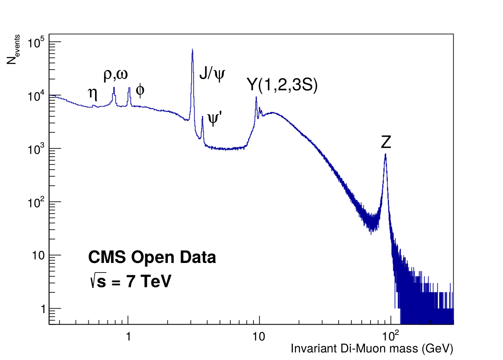

# Convert CMS 2011 data from AOD to NanoAOD

This project takes AOD files from CMS OpenData and rewrites these in a structure similar to the NanoAOD format. The processed data is published on the CERN OpenData platform and contains data events taken with the CMS detector at the LHC during 2011. The output of the full toolchain described below results in the following plot of the Di-Muon spectrum.



## Setup CMSSW

```bash
source /cvmfs/cms.cern.ch/cmsset_default.sh
cmsrel CMSSW_5_3_32
```

## Build module

```bash
cd CMSSW_5_3_32/src
mkdir workspace
cd workspace
git clone <THIS REPOSITORY> aod2nanoaod
cd aod2nanoaod
scram b -j8
```

## Execute CMSSW config running conversion

```bash
cmsRun aod2nanoaod_cfg.py 2> log.txt
```

## Postprocess ROOT file

```bash
root -l -q postprocess_nanoaod.C
```

## Build and run program analyzing the data with RDataFrame

```bash
# NOTE: Source recent ROOT version with RDataFrame support
./build.sh
./nanoaod_dimuon_spectrum
```

## References

Reference project for implemenation of CMSSW analyzer:

http://opendata.cern.ch/record/5001

Documentation of physics objects in 2011 data:

http://opendata.cern.ch/docs/cms-physics-objects-2011

Getting started guide for CMS 2011 Open Data:

http://opendata.cern.ch/docs/cms-getting-started-2011

List of validated runs for primary datasets of 2011 data taking:

http://opendata.web.cern.ch/record/1001
